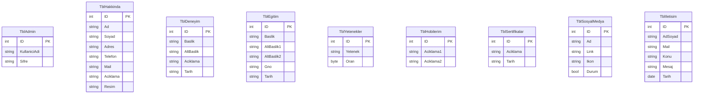

<div align="center">

  <!-- Logo / Banner Placeholder -->
  <a href="https://github.com/emirhansapmaz/MvcCV">
    
  </a>

  <br />
  <br />

  <h1>🚀 .NET 10 Dinamik CV & Portfolyo Yönetim Sistemi</h1>

  <p align="center">
    <strong>Modern, Yüksek Performanslı, Yönetilebilir ve Ölçeklenebilir Kişisel Portfolyo Çözümü</strong>
  </p>

  <p align="center">
    <a href="#-proje-hakkında">Proje Hakkında</a> •
    <a href="#-kullanılan-teknolojiler">Teknolojiler</a> •
    <a href="#-proje-mimarisi-ve-tasarım-desenleri">Mimari</a> •
    <a href="#-temel-özellikler">Özellikler</a> •
    <a href="#-veritabanı-şeması">Veritabanı</a> •
    <a href="#-kurulum-ve-çalıştırma">Kurulum</a> •
    <a href="#-ekran-görüntüleri">Ekran Görüntüleri</a>
  </p>

  <!-- Badges -->
  <p align="center">
    
    
    
    
    
    
    
    
  </p>

</div>

---

## 📌 Proje Hakkında

**.NET 10 Dinamik CV ve Portfolyo Yönetim Sistemi**, modern yazılım geliştirme standartları gözetilerek inşa edilmiş, kurumsal seviyede dinamik bir kişisel tanıtım ve içerik yönetim platformudur.

Projenin temel amacı; bir yazılımcının veya profesyonelin deneyimlerini, projelerini, eğitim geçmişini, sertifikalarını ve yeteneklerini en modern UI/UX trendleriyle sergilerken, arka planda tek satır kod yazma ihtiyacı duymadan tüm verilerin güvenli bir yönetim panelinden yönetilebilmesini sağlamaktır.

Güçlü **ASP.NET Core MVC (.NET 10)** omurgası, **Generic Repository Pattern** mimarisi ve optimize edilmiş **Entity Framework Core (Database-First)** altyapısıyla geliştirilen bu çözüm; hem ziyaretçilere akıcı bir tek sayfa (Single-Page) gezinme deneyimi yaşatır hem de yöneticilere kusursuz bir içerik kontrolü sunar.

---

## 🛠️ Kullanılan Teknolojiler

Bu projede sektör standartlarında, performans odaklı ve güncel kütüphaneler tercih edilmiştir:

| Kategori | Teknoloji / Kütüphane | Açıklama |
| :--- | :--- | :--- |
| **Framework & Dil** | `C# 13` / `.NET 10.0` | En güncel .NET LTS ekosistemi ve modern C# yenilikleri |
| **Web Çatısı** | `ASP.NET Core MVC` | Model-View-Controller mimarisi ile modüler ve ölçeklenebilir yapı |
| **ORM & Veri Erişimi** | `Entity Framework Core 10` | Database-First yaklaşımı, `DbCvContext` ve LINQ sorguları |
| **Veritabanı** | `Microsoft SQL Server` | İlişkisel, optimize edilmiş kurumsal veritabanı motoru |
| **Tasarım Deseni** | `Generic Repository Pattern` | CRUD operasyonlarını merkezileştiren soyutlama katmanı |
| **Kimlik & Yetkilendirme**| `Cookie-Based Authentication` & `Session` | Güvenli oturum yönetimi ve Global Authorization Filter |
| **Frontend Arayüzü** | `HTML5`, `CSS3`, `JavaScript`, `Bootstrap 5` | Responsive, mobil uyumlu ve modern Single-Page düzen |
| **Tipografi & İkonlar** | `Google Fonts (Plus Jakarta Sans)` & `Font Awesome 6` | Estetik görünüm ve zengin vektörel ikon kütüphanesi |
| **Yönetim Paneli UI** | `AdminLTE 3.0.4` | Responsive kartlar, veri tabloları ve modern yönetim bileşenleri |

---

## 🏗️ Proje Mimarisi ve Tasarım Desenleri

Proje, kurumsal yazılım mimarisi standartları dikkate alınarak **modüler, yeniden kullanılabilir ve gevşek bağlı (loosely coupled)** bileşenler üzerine kurulmuştur:

```text
MvcCV
│
├── 📁 Controllers/         # İstekleri yöneten ve repository katmanıyla haberleşen MVC denetleyicileri
│   ├── DefaultController.cs        -> Ziyaretçi vitrin arayüzü ve iletişim mesaj alımı
│   ├── LoginController.cs          -> Cookie Authentication ve Admin oturum kontrolü
│   ├── AdminController.cs          -> Yönetim paneli kullanıcı yönetimi
│   └── [Modül]Controller.cs       -> Deneyim, Eğitim, Yetenek vb. CRUD denetleyicileri
│
├── 📁 Models/              # EF Core ile veritabanından üretilen POCO entity modelleri
│   ├── DbCvContext.cs              -> Veritabanı bağlantı ve tablo eşleme bağlamı
│   └── Tbl[Modül].cs               -> İlgili tablonun entity modeli
│
├── 📁 Repositories/        # Veri erişim soyutlaması ve Generic Repository implementasyonu
│   ├── GenericRepository.cs        -> Tip bağımsız (T entity) genel CRUD metotları
│   └── [Modül]Repository.cs       -> Modüle özel repository sınıfları
│
├── 📁 Views/               # Razor View sayfaları ve parçalı yapılar
│   ├── 📁 Default/                 -> Single-Page vitrin sayfası (Index.cshtml)
│   ├── 📁 ViewComponents/          -> Vitrindeki modülleri besleyen bağımsız ViewComponent'ler
│   ├── 📁 Shared/                  -> _Layout.cshtml ve _AdminLayout.cshtml şablonları
│   └── 📁 [Modül]/                 -> Admin paneli modül yönetim ekranları
│
└── 📁 wwwroot/             # Statik dosyalar (Modern CSS, JS, AdminLTE, Görseller)
```

### 1. Generic Repository Pattern
Veritabanı işlemlerinde kod tekrarını sıfıra indirmek ve test edilebilirliği artırmak için `GenericRepository<T>` sınıfı uygulanmıştır:
- `List()` : İlgili tablodaki tüm kayıtları listeler.
- `Insert(T p)` : Yeni kayıt ekler.
- `delete(T p)` : Kaydı siler.
- `Update(T p)` : Kaydı günceller.
- `TGetir(int id)` : ID bazlı tekil kayıt çeker.
- `Find(Expression<Func<T, bool>> where)` : Lambda/LINQ ifadeleriyle filtrelenmiş arama yapar.

### 2. ViewComponent Modülerliği
Tek sayfalık (Single-Page) vitrin sayfasında her bir bölüm (`Deneyim`, `Egitim`, `Hobi`, `Iletisim`, `Sertifika`, `SosyalMedya`, `Yetenek`) bağımsız bir **ViewComponent** olarak kodlanmıştır. Bu sayede her bileşen kendi veri mantığını izole biçimde yönetir ve sayfa performansı maksimize edilir.

### 3. Global Authorization & Güvenlik Politikası
`Program.cs` seviyesinde uygulanan `AuthorizeFilter` ile sistem varsayılan olarak **tamamen kapalı** prensibiyle çalışır. Yalnızca ziyaretçilere açık vitrin sayfası (`[AllowAnonymous]`) kimlik doğrulamasız görüntülenebilirken, yönetim panelinin tüm uç noktaları **Cookie tabanlı kimlik doğrulama** süzgecinden geçirilir.

---

## 🌟 Temel Özellikler

### 🌐 1. Ziyaretçi Arayüzü (Public Portfolio)
* **Single-Page & Scroll-Spy:** Sayfa yenilenmeden akıcı menü geçişleri ve ekran kaydırıldıkça otomatik güncellenen aktif menü takibi.
* **Modern Koyu Tema & Cam Efekti (Glassmorphism):** Göz yormayan, kontrast dengesi yüksek, modern UI trendlerine uygun koyu renk paleti.
* **Profil ve "Müsait" Durum Rozeti:** Anlık çalışma durumunu gösteren animasyonlu nabız efektli durum indikatörü.
* **Timeline Formatında Deneyim & Eğitim:** Başlık, alt başlık, tarih aralığı ve detaylı açıklamaları içeren kronolojik zaman çizelgesi.
* **İlerleme Çubuğu (Progress Bar) Yetenekler:** Yetenek seviyelerini dinamik yüzdelik çubuklarla görselleştiren interaktif kartlar.
* **Bento-Grid Hobiler:** İlgi alanlarını modern Bento-Grid kutucuklarında sunan estetik içerik alanı.
* **Dinamik Sosyal Medya Bağlantıları:** Veritabanından yönetilen, Font Awesome ikonlarıyla zenginleştirilmiş sosyal medya butonları.
* **Anlık Kayıtlı İletişim Formu:** Ziyaretçilerin doğrudan form üzerinden mesaj bırakabilmesi ve mesajın veritabanına anlık tarih damgasıyla (`DateOnly`) kaydedilmesi.

---

### 🔒 2. Yönetici Paneli (Admin CMS)
* **Şifreli Giriş & Oturum Güvenliği:** Yetkisiz erişimleri engelleyen Cookie & Session altyapılı kimlik doğrulama ekranı.
* **AdminLTE 3 Entegrasyonu:** Kullanıcı dostu, sol gezinme menülü, bildirim rozetli profesyonel dashboard düzeni.
* **Tam Kapsamlı CRUD Kontrolü:** Aşağıdaki tüm bölümler için kod yazmadan Ekle / Sil / Güncelle / Listele imkanı:
  * 👤 **Hakkımda:** Ad, Soyad, Unvan, Adres, Telefon, E-Posta, Açıklama ve Profil Fotoğrafı URL'i yönetimi.
  * 💼 **Deneyimler:** Pozisyon, şirket/kurum, tarih ve görev tanımı yönetimi.
  * 🎓 **Eğitim:** Okul, fakülte, bölüm, mezuniyet not ortalaması (GNO) ve tarih yönetimi.
  * ⚡ **Yetenekler:** Teknoloji adı ve yetkinlik yüzdesi (0-100%) yönetimi.
  * 🎨 **Hobiler:** İlgi alanları ve kişisel uğraş metinleri.
  * 🏆 **Sertifikalar:** Alınan sertifikalar, kurumlar ve tarihleri.
  * 🌐 **Sosyal Medya:** Platform adı, profil URL'i, Font Awesome ikonu ve Aktif/Pasif durum kontrolü.
* **Gelen Mesaj Kutusu:** İletişim formu üzerinden gelen mesajların gönderen adı, e-posta adresi, konusu, mesaj metni ve tarihiyle birlikte kronolojik listelenmesi.
* **Yönetici Hesabı Yönetimi:** Admin kullanıcı adı ve şifre bilgilerinin kontrolü.

---

## 🗄️ Veritabanı Şeması

Proje, **SQL Server** üzerinde ilişkisel mantıkla kurgulanmış 9 temel tablodan oluşur:



| Tablo Adı | Sorumluluğu / İçeriği |
| :--- | :--- |
| `TblAdmin` | Yönetim paneline giriş yapmaya yetkili yönetici hesapları |
| `TblHakkinda` | Portfolyo sahibinin kişisel bilgileri, iletişim kanalları, tanıtım yazısı ve profil görseli |
| `TblDeneyim` | Geçmiş ve mevcut iş/staj deneyimleri, görev tanımları ve çalışma periyotları |
| `TblEgitim` | Üniversite, lise, lisansüstü eğitim bilgileri ve akademik başarı notları |
| `TblYetenekler` | Teknik yetkinlikler ve her yetkinliğin yüzde cinsinden seviye puanı |
| `TblHobilerim` | Kişisel ilgi alanları, spor, teknoloji ve günlük aktivite açıklamaları |
| `TblSertifikalar` | Kazanılan ulusal/uluslararası sertifikalar, eğitimler ve kazanım tarihleri |
| `TblSosyalMedya` | Sosyal medya hesap bağlantıları, Font Awesome ikon sınıfları ve yayında olma (durum) bayrağı |
| `TblIletisim` | Ziyaretçilerin web sitesi üzerinden gönderdiği iletişim mesajları ve gönderim tarihi |

---

## ⚙️ Kurulum ve Çalıştırma

Projeyi yerel geliştirme ortamınızda ayağa kaldırmak için aşağıdaki adımları sırasıyla takip edebilirsiniz:

### Ön Gereksinimler
- [.NET 10.0 SDK](https://dotnet.microsoft.com/download) veya daha yenisi
- [Microsoft SQL Server](https://www.microsoft.com/sql-server/) (Express veya LocalDB)
- [SQL Server Management Studio (SSMS)](https://learn.microsoft.com/sql/ssms/download-sql-server-management-studio-ssms) veya Azure Data Studio
- [Visual Studio 2022 / 2026](https://visualstudio.microsoft.com/) (.NET masaüstü ve web geliştirme iş yükü ile) veya VS Code

---

### Adım Adım Kurulum

#### 1. Projeyi Klonlayın
```bash
git clone https://github.com/emirhansapmaz/MvcCV.git
cd MvcCV/MvcCV
```

#### 2. Veritabanını Oluşturun
SQL Server Management Studio (SSMS) açarak `DbCV` adında yeni bir veritabanı oluşturun ve yukarıdaki şemaya uygun tabloları çalıştırın:
```sql
CREATE DATABASE DbCV;
GO
USE DbCV;
GO

CREATE TABLE TblAdmin (
    ID INT PRIMARY KEY IDENTITY(1,1),
    KullaniciAdi NVARCHAR(50) NOT NULL,
    Sifre NVARCHAR(50) NOT NULL
);

CREATE TABLE TblHakkinda (
    ID INT PRIMARY KEY IDENTITY(1,1),
    Ad NVARCHAR(50),
    Soyad NVARCHAR(50),
    Adres NVARCHAR(100),
    Telefon NVARCHAR(20),
    Mail NVARCHAR(50),
    Aciklama NVARCHAR(MAX),
    Resim NVARCHAR(250)
);

CREATE TABLE TblDeneyim (
    ID INT PRIMARY KEY IDENTITY(1,1),
    Baslik NVARCHAR(100),
    AltBaslik NVARCHAR(100),
    Aciklama NVARCHAR(MAX),
    Tarih NVARCHAR(100)
);

CREATE TABLE TblEgitim (
    ID INT PRIMARY KEY IDENTITY(1,1),
    Baslik NVARCHAR(100),
    AltBaslik1 NVARCHAR(100),
    AltBaslik2 NVARCHAR(100),
    Gno NVARCHAR(10),
    Tarih NVARCHAR(100)
);

CREATE TABLE TblYetenekler (
    ID INT PRIMARY KEY IDENTITY(1,1),
    Yetenek NVARCHAR(100),
    Oran TINYINT
);

CREATE TABLE TblHobilerim (
    ID INT PRIMARY KEY IDENTITY(1,1),
    Aciklama1 NVARCHAR(MAX),
    Aciklama2 NVARCHAR(MAX)
);

CREATE TABLE TblSertifikalar (
    ID INT PRIMARY KEY IDENTITY(1,1),
    Aciklama NVARCHAR(250),
    Tarih NVARCHAR(30)
);

CREATE TABLE TblSosyalMedya (
    ID INT PRIMARY KEY IDENTITY(1,1),
    Ad NVARCHAR(30),
    Link NVARCHAR(200),
    Ikon NVARCHAR(50),
    Durum BIT DEFAULT 1
);

CREATE TABLE TblIletisim (
    ID INT PRIMARY KEY IDENTITY(1,1),
    AdSoyad NVARCHAR(100),
    Mail NVARCHAR(100),
    Konu NVARCHAR(100),
    Mesaj NVARCHAR(MAX),
    Tarih DATE
);

-- Varsayılan Admin Kullanıcısı Ekleme
INSERT INTO TblAdmin (KullaniciAdi, Sifre) VALUES ('admin', '1234');
GO
```

#### 3. Bağlantı Dizesini (Connection String) Düzenleyin
`MvcCV/appsettings.json` dosyasını açarak SQL Server sunucu adınızı güncelleyin:
```json
{
  "Logging": {
    "LogLevel": {
      "Default": "Information",
      "Microsoft.AspNetCore": "Warning"
    }
  },
  "AllowedHosts": "*",
  "ConnectionStrings": {
    "DefaultConnection": "Server=YOUR_SERVER_NAME;Database=DbCV;Trusted_Connection=True;TrustServerCertificate=True;"
  }
}
```

#### 4. Paketleri Yükleyin ve Projeyi Derleyin
```bash
dotnet restore
dotnet build
```

#### 5. Projeyi Çalıştırın
```bash
dotnet run
```
Tarayıcınız üzerinden aşağıdaki adreslere erişebilirsiniz:
* **Vitrin Sayfası:** `https://localhost:7087/Default/Index` veya `https://localhost:5001/`
* **Yönetici Girişi:** `https://localhost:7087/Login/Index`
  * **Kullanıcı Adı:** `admin`
  * **Şifre:** `1234`

---

## 📸 Ekran Görüntüleri

> 💡 *Aşağıdaki bölümlere uygulamanızdan aldığınız ekran görüntülerini ekleyebilirsiniz.*

| Bölüm | Önizleme |
| :--- | :--- |
| **Ziyaretçi Arayüzü (Ana Sayfa & Hakkımda)** |  |
| **Deneyimler & Eğitim Zaman Çizelgesi** |  |
| **Yetenekler (Progress Bars) & Bento Hobiler** |  |
| **Admin Giriş Sayfası** |  |
| **AdminLTE Yönetim Paneli** |  |
| **İçerik Düzenleme & CRUD İşlemleri** |  |

---

## 🤝 Katkıda Bulunma

Projeye katkıda bulunmaktan mutluluk duyarız! Herhangi bir öneri, hata bildirimi veya özellik talebi için:
1. Bu depoyu **Fork**'layın (`https://github.com/emirhansapmaz/MvcCV/fork`)
2. Yeni bir özellik dalı oluşturun (`git checkout -b feature/YeniOzellik`)
3. Değişikliklerinizi commit'leyin (`git commit -m 'feat: Yeni özellik eklendi'`)
4. Dalınıza push'layın (`git push origin feature/YeniOzellik`)
5. Bir **Pull Request (PR)** açın

---

## 📄 Lisans

Bu proje [MIT Lisansı](LICENSE) kapsamında lisanslanmıştır. Dilediğiniz gibi kullanabilir, özelleştirebilir ve geliştirebilirsiniz.

---

<div align="center">
  <sub>Geliştirici: <strong>Emirhan Sapmaz</strong> • <a href="https://github.com/emirhansapmaz">GitHub Profilim</a></sub>
</div>